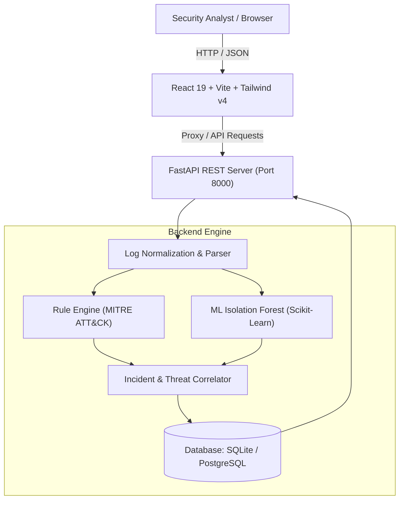

# 🛡️ AI-Log Sentinel — Complete Documentation & User Guide

[](https://ai-logsentinel.onrender.com)
[](https://github.com/Tulsisah/LogSentinel)

---

## 📌 Table of Contents
- [✨ Key Features](#-key-features)
- [🏗️ System Architecture](#️-system-architecture)
- [📋 Prerequisites](#-prerequisites)
- [🚀 Instructions to Clone & Run Locally](#-instructions-to-clone--run-locally)
  - [1. Clone the Repository](#1-clone-the-repository)
  - [2. Start Backend (FastAPI)](#2-start-backend-fastapi)
  - [3. Start Frontend (React + Vite)](#3-start-frontend-react--vite)
- [🐳 Running with Docker Compose](#-running-with-docker-compose)
- [🧪 1-Click Demo Walkthrough](#-1-click-demo-walkthrough)
- [🎨 Theme Customization](#-theme-customization)
- [⚙️ Environment Variables Reference](#️-environment-variables-reference)
- [📡 REST API Endpoints & Swagger Docs](#-rest-api-endpoints--swagger-docs)
- [🚢 Production Deployment](#-production-deployment)
- [🛡️ Security Best Practices](#️-security-best-practices)

---

## ✨ Key Features

- **Multi-Format Log Ingestion**: Upload `.log`, `.txt`, `.csv` files, or paste raw syslog lines directly through the UI.
- **Hybrid Threat Detection Engine**:
  - **Rule-Based Engine**: Identifies Brute Force attacks, Account Compromise, Unauthorized Privilege Escalation, Malicious PowerShell / Shell Execution, and Large Data Exfiltration.
  - **Unsupervised ML Anomaly Detection**: Uses **Scikit-learn Isolation Forest** to score deviations without needing pre-labeled training datasets.
  - **Hybrid Risk Scoring**: Blends rule-based severity with mathematical anomaly scores into a standardized 0–100 risk scale.
- **Interactive SOC Dashboard**: Real-time traffic timelines, severity distribution charts, top targeted accounts, and suspicious IP frequency charts.
- **Incident Response & Timeline Investigation**: Track and escalate security incidents through states: `New` → `Investigating` → `Resolved` → `False Positive`.
- **IP Threat Intelligence**: Deep-dive analytics per endpoint IP, tracking event velocity, failed logins, and suspicious activity history.
- **Custom Rule Engine**: Security analysts can build, test, and activate custom detection rules on the fly with custom thresholds and regex matching.
- **AI Security Copilot**: Contextual incident explanation, root cause analysis, and automated Sigma rule generation.
- **Executive PDF & HTML Reports**: Generate executive summaries ready for CISO/management reporting.
- **Dual Theme Support**: Includes a dark Cyber SOC theme and a light theme (`#E6FDFF`) with a 1-click header switcher.

---

## 🏗️ System Architecture



---

## 📋 Prerequisites

Before starting, ensure you have the following installed on your machine:
- **Git**: [Download Git](https://git-scm.com/downloads)
- **Python**: Version `3.10` or higher ([Download Python](https://python.org))
- **Node.js**: Version `18.0` or higher ([Download Node.js](https://nodejs.org))
- *(Optional)* **Docker & Docker Compose**: [Docker Desktop](https://www.docker.com/products/docker-desktop)

---

## 🚀 Instructions to Clone & Run Locally

### 1. Clone the Repository

Open your terminal (PowerShell, Command Prompt, or Bash) and clone the repository:

```bash
# Clone the repository
git clone https://github.com/Tulsisah/LogSentinel.git

# Enter project root directory
cd LogSentinel
```

---

### 2. Start Backend (FastAPI)

Open a terminal window and set up the Python backend:

#### On Windows (PowerShell):
```powershell
# Navigate to backend directory
cd backend

# Create a virtual environment
python -m venv venv

# Activate the virtual environment
.\venv\Scripts\activate

# Install all backend dependencies
pip install -r requirements.txt

# Start the FastAPI server
uvicorn app.main:app --reload --port 8000
```

#### On Linux / macOS (Bash):
```bash
# Navigate to backend directory
cd backend

# Create a virtual environment
python3 -m venv venv

# Activate the virtual environment
source venv/bin/activate

# Install all backend dependencies
pip install -r requirements.txt

# Start the FastAPI server
uvicorn app.main:app --reload --port 8000
```

- **Backend API Base**: [http://localhost:8000](http://localhost:8000)
- **Interactive Swagger API Docs**: [http://localhost:8000/docs](http://localhost:8000/docs)
- **Health Check Endpoint**: [http://localhost:8000/api/health](http://localhost:8000/api/health)

---

### 3. Start Frontend (React + Vite)

Open a **second terminal window** in the project root:

```bash
# Navigate to frontend directory
cd frontend

# Install node dependencies
npm install

# Start the Vite development server
npm run dev
```

- **SOC Web Dashboard**: [http://localhost:5173](http://localhost:5173)

> The Vite frontend automatically proxies all `/api` network requests to `http://localhost:8000`.

---

## 🐳 Running with Docker Compose

If you have Docker installed, you can start the entire stack (FastAPI backend + React frontend + PostgreSQL database) with a single command:

```bash
# 1. Create your environment configuration
cp .env.example .env

# 2. Build and launch all containers
docker compose up --build
```

- The platform is immediately accessible at **[http://localhost:8000](http://localhost:8000)** (FastAPI serves both the API and the production React bundle).
- Database data is persisted automatically in the `pgdata` volume.

To stop the containers:
```bash
docker compose down
```

---

## 🧪 1-Click Demo Walkthrough

Want to see the system in action with zero configuration?

1. Open **[https://ai-logsentinel.onrender.com](https://ai-logsentinel.onrender.com)** (or `http://localhost:5173` locally).
2. In the left navigation menu, click **Upload & Ingest**.
3. Under the upload area, click the **"Simulate Attack Chain"** demo button.
4. The system will simulate a realistic multi-stage cyber attack scenario:
   - **09:00** — Normal user login (`jdoe`)
   - **09:05** — Normal file read activity
   - **09:20** — Rapid failed authentication attempts (`Brute Force Attack` by `192.168.1.45`)
   - **09:22** — Successful authentication following brute force (`Account Compromise`)
   - **09:23** — Privileged PowerShell execution with base64-encoded payload (`Execution / Defense Evasion`)
   - **09:25** — Abnormal high-volume data exfiltration (`Exfiltration`)
5. Navigate to:
   - **Dashboard**: Review real-time analytics, severity breakdowns, and threat charts.
   - **Security Alerts**: Inspect correlated alerts with MITRE ATT&CK tactical classifications and ML scores.
   - **Incidents & Timeline**: Review correlated incidents and update investigation statuses (`Investigating`, `Resolved`).
   - **AI Security Copilot**: Ask questions about the incident and receive automated remediation playbooks.

---

## 🎨 Theme Customization

The platform features built-in theme support accessible from the header (top-right, directly before "SOC Live Active"):
- **☀️ Light Mode**: Features a clean `#E6FDFF` background with white card surfaces and dark slate typography.
- **🌙 Dark Mode**: Cyber SOC slate theme with neon highlights and inverted indicators.
- User preference is saved across sessions in `localStorage`.

---

## ⚙️ Environment Variables Reference

Copy `.env.example` to `.env` to customize settings:

| Variable | Default Value | Description |
| :--- | :--- | :--- |
| `PORT` | `8000` | Port for the FastAPI server to listen on. |
| `JWT_SECRET` | *(Random string)* | 32+ character secret key for signing analyst tokens. |
| `DATABASE_URL` | *(empty = SQLite)* | Database URI (`sqlite:///./analyzer.db` or PostgreSQL `postgresql://...`). |
| `ALLOWED_ORIGINS` | `http://localhost:5173,...` | Comma-separated list of allowed CORS domains. |
| `VITE_API_URL` | `/api` | Base URL for frontend API requests (proxied locally). |

---

## 📡 REST API Endpoints & Swagger Docs

Once the backend is running, explore all endpoints interactively at **[http://localhost:8000/docs](http://localhost:8000/docs)**.

| Method | Endpoint | Description |
| :--- | :--- | :--- |
| `GET` | `/api/health` | Service health status check |
| `POST` | `/api/logs/upload` | Upload `.log`, `.txt`, or `.csv` files |
| `POST` | `/api/logs/paste` | Ingest raw log lines directly |
| `POST` | `/api/logs/sample` | Ingest built-in attack timeline demo |
| `GET` | `/api/logs` | Query, filter, and paginate parsed logs |
| `GET` | `/api/dashboard/stats` | Aggregated metrics, charts, and top indicators |
| `GET` | `/api/alerts` | List detected security alerts |
| `GET` | `/api/alerts/{id}` | Detailed alert evidence and MITRE techniques |
| `GET` | `/api/incidents` | Correlated security incident cases |
| `PUT` | `/api/incidents/{id}/status` | Update incident status and analyst notes |
| `GET` | `/api/ips` | IP endpoint risk profiling and event history |
| `GET` | `/api/rules` | Manage rule-based detection configurations |
| `POST` | `/api/copilot/chat` | AI SOC assistant threat queries |
| `GET` | `/api/reports/executive` | Generate CISO executive security reports |

---

## 🚢 Production Deployment

For deploying to cloud providers such as **Render**, **Railway**, **Vercel**, **Docker**, or **Linux VPS**, refer to the detailed [DEPLOYMENT.md](DEPLOYMENT.md) guide included in this repository.

---

## 🛡️ Security Best Practices

1. **Keep Secrets Out of Version Control**: The `.gitignore` files are pre-configured to exclude all `.env`, database, and virtual environment files.
2. **Rotate JWT Secret**: When deploying to production, generate a strong cryptographically secure key:
   ```bash
   python -c "import secrets; print(secrets.token_hex(32))"
   ```
3. **Database Backups**: When using SQLite in production, mount a persistent volume; for high traffic, connect a managed PostgreSQL instance.

---

## 📄 License

This project is licensed under the MIT License — see the [LICENSE](LICENSE) file for details.
